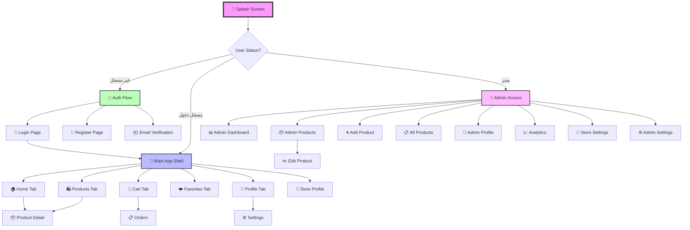
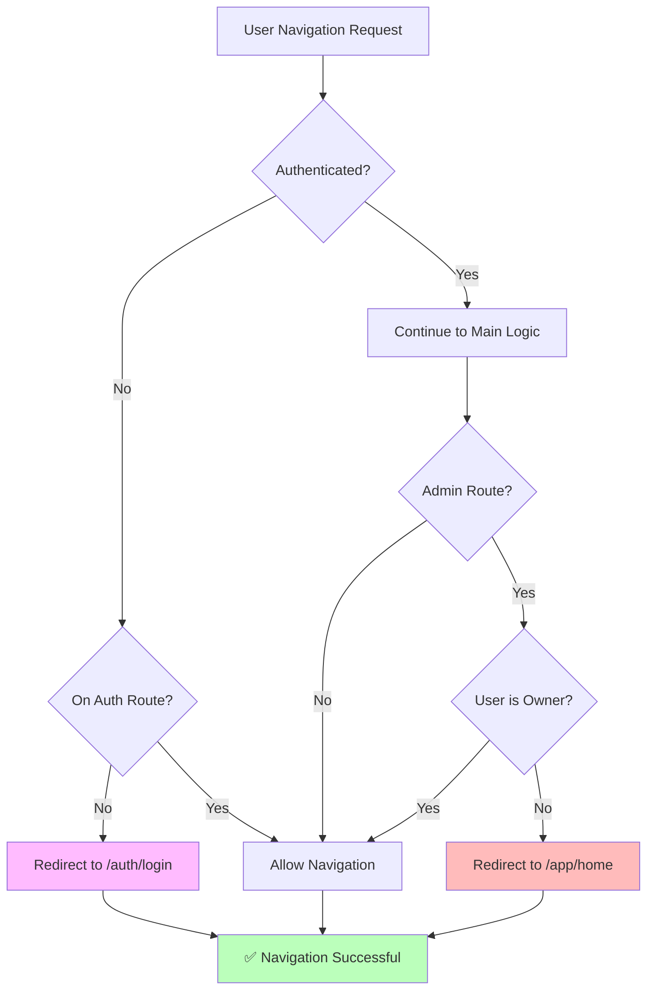
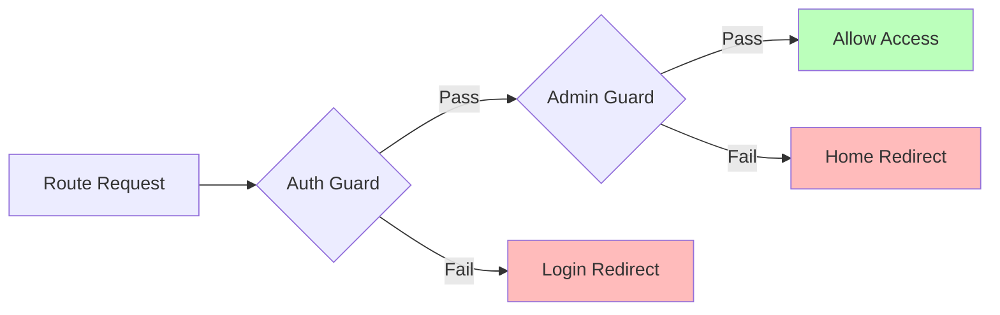

# مخطط التنقل البصري - نظام Thawbuk Store المحسن

## 🎯 الرحلة الكاملة للمستخدم



## 🔄 أنواع التنقل بالتفصيل

### 1. Go Navigation (Shell Routes)
```
🏪 Main App Shell
┌─────────────────────────────────┐
│  AppBar (Fixed)                 │
├─────────────────────────────────┤
│                                 │
│  Dynamic Content Area           │ ← يتغير حسب الـ Tab
│  (Home/Products/Cart/etc.)      │
│                                 │
├─────────────────────────────────┤
│  Bottom Navigation (Fixed)      │ ← يبقى ثابت
│  [🏠] [🛍️] [🛒] [❤️] [👤]        │
└─────────────────────────────────┘

Navigation: context.nav.goToProducts()
Result: Content يتغير، Bottom Nav يبقى، URL يتحديث
Back Button: يخرج من التطبيق (لأنه Root level)
```

### 2. Push Navigation (Standalone Pages)
```
📦 Product Detail Page
┌─────────────────────────────────┐
│  AppBar with Back Button        │ ← زر رجوع تلقائي
├─────────────────────────────────┤
│                                 │
│  Product Details Content        │
│                                 │
│                                 │
├─────────────────────────────────┤
│  No Bottom Navigation           │ ← لا يوجد Bottom Nav
└─────────────────────────────────┘

Navigation: context.nav.goToProductDetail('123')
Result: صفحة جديدة فوق الموجودة
Back Button: يرجع للصفحة السابقة
```

## 🧠 منطق التوجيه (Redirect Logic)



## 🏗️ بنية الـ State Management

```
┌─────────────────────────────────────────┐
│           BlocProvider Tree             │
├─────────────────────────────────────────┤
│  AuthBloc (Global)                      │
│  ├── ProductBloc                        │
│  ├── CartBloc                           │
│  ├── AdminBloc                          │
│  └── CategoryBloc                       │
├─────────────────────────────────────────┤
│           Navigation Layer              │
│  ├── AppRouterImproved                  │
│  ├── NavigationService                  │
│  └── Shell Routes                       │
├─────────────────────────────────────────┤
│            UI Layer                     │
│  ├── MainAppShell                       │
│  ├── AdminShell                         │
│  └── Individual Pages                   │
└─────────────────────────────────────────┘
```

## 📱 تجربة المستخدم المتوقعة

### للمستخدم العادي:
```
1. فتح التطبيق → Splash Screen (2s)
2. تحقق من Auth → Login Page (إذا لم يسجل دخول)
3. بعد Login → Home Page في Main Shell
4. Navigation بين Tabs → Content يتغير، Bottom Nav ثابت
5. دخول Product Detail → صفحة جديدة مع Back Button
6. Back Button → رجوع لآخر Tab كان فيه
7. Tab Navigation → استمرار سلس بدون Rebuild
```

### للمدير:
```
1. نفس البداية للمستخدم العادي
2. دخول Admin Area → Admin Shell منفصل
3. Admin Tabs → Navigation مستقل عن Main App
4. Edit/Analytics → صفحات Push مع Back navigation
5. Exit Admin → رجوع للـ Main App Shell
6. Switch بين Main/Admin → contexts منفصلة
```

## 🎨 Animation Flow

```
Tab Navigation (Go):
Page A ========> Page B
       (Fade transition, 300ms)

Push Navigation:
Page A ========> Page B
       (Slide from right, 300ms)
       
Pop Navigation:
Page B ========> Page A
       (Slide to right, 300ms)
```

## 🔍 الحالات الخاصة (Edge Cases)

### 1. Deep Links:
```
User clicks: thawbuk://app/product/123
↓
System checks: Is user authenticated?
├── No → Redirect to login, save intended route
├── Yes → Navigate directly to product detail
└── After login → Continue to saved route
```

### 2. Back Button Behavior:
```
Context: User in Admin Edit Product
Press Back → Return to Admin Products (correct)

Context: User in Main App Home
Press Back → Exit app (correct)

Context: User in Settings (from Main App)
Press Back → Return to last Main App tab (correct)
```

### 3. Memory Management:
```
Main App Shell: Always in memory (for quick switching)
Admin Shell: Created on demand, destroyed on exit
Push Pages: Created on push, destroyed on pop
Cached Data: Managed by Blocs, persistent across navigation
```

## 🚀 Performance Characteristics

```
Navigation Type    | Time (ms) | Memory Impact | State Preservation
-------------------|-----------|---------------|-------------------
Tab Switch (Go)    | 50-100   | Low           | ✅ Full
Push Navigation    | 100-200  | Medium        | ✅ Previous page
Pop Navigation     | 50-100   | Low (cleanup) | ✅ Destination
Auth Redirect      | 200-300  | Medium        | ❌ Reset needed
```

## 🛡️ Security & Guards



---

## 📊 ملخص التحسينات

| المشكلة القديمة | الحل الجديد |
|----------------|-------------|
| تعقيد في التنقل | NavigationService موحد |
| Back button لا يعمل | Shell Routes + Push navigation |
| فقدان الـ State | State preservation في Shells |
| Hard-coded routes | Route constants + Type safety |
| تبعية معقدة | Clean Architecture |
| صعوبة الصيانة | Modular structure |

### نتيجة التحسين: ⭐⭐⭐⭐⭐
- **User Experience**: محسنة بشكل كبير
- **Developer Experience**: سهولة في التطوير والصيانة  
- **Performance**: تحسن ملحوظ في السرعة والذاكرة
- **Scalability**: قابلية عالية للتوسع والتطوير